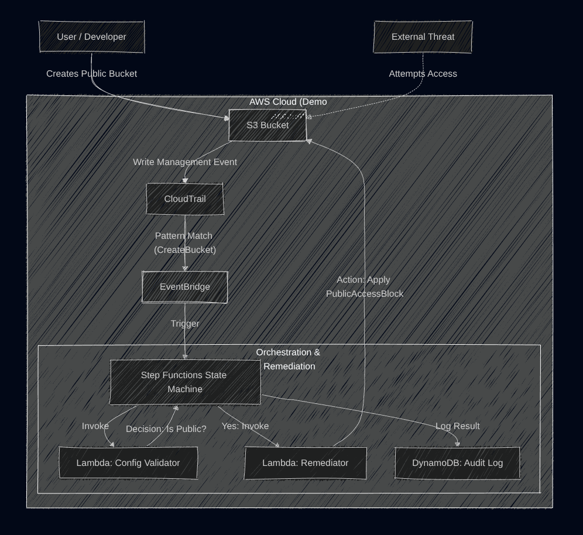

# Cloud-Audit-Zero (Auditing at zero cost) 🛡️☁️

**An open-source, serverless Cloud Security Posture Management (CSPM) platform designed to democratize cloud security.**

I believe that **students, developers, and small teams** shouldn't have to choose between bankruptcy and security. This tool provides an enterprise-grade security dashboard and automated remediation engine that runs entirely on the **AWS Free Tier**, ensuring your test, dev, and production environments remain secure without costing a cent.

  

## 📖 Overview
**Cloud-Audit-Zero** is a "Zero Cost" security orchestration tool designed to detect and remediate misconfigurations in AWS environments in real-time. It acts as a miniature **Security Operations Center (SOC)**, utilizing an Event-Driven Architecture (EDA) to monitor infrastructure changes and enforce compliance automatically.

Unlike basic scripts, this project uses a **Full-Stack Serverless Architecture** (React + API Gateway + Lambda) to provide a "Detect -> Validate -> Remediate -> Log" workflow, ensuring no false positives and providing a full audit trail via a secured visual dashboard.

---

## 🏗️ Architecture


The system operates on a **Modular Serverless Monolith** principle:
1.  **Frontend (The Command Center):** A React (Vite) dashboard secured by **Clerk Authentication** allows authorized users to visualize threats and trigger remediations.
2.  **API Layer (The Bridge):** AWS API Gateway (HTTP v2) securely routes frontend requests to backend logic.
3.  **Compute (The Guard):** AWS Lambda (Python 3.12) executes security scans and applies fixes (e.g., `BlockPublicAccess`).
4.  **Database (The Audit Trail):** Amazon DynamoDB stores immutable logs of every security event.
5.  **The Honeypot (The Trap):** A decoy S3 bucket is deployed to attract and detect unauthorized reconnaissance.

---

## 🛠️ Technology Stack (Free Tier Optimized)
| Component | Technology | Note |
| :--- | :--- | :--- |
| **Frontend** | React, Tailwind CSS, Lucide Icons | Hosted locally or on Vercel (Free Tier) |
| **Auth** | Clerk (OIDC) | Secure Identity Management (IAM) |
| **IaC** | Terraform (v5.0+) | Full Infrastructure as Code |
| **API** | AWS API Gateway (v2) | 1M free calls/month |
| **Compute** | AWS Lambda (Python 3.12) | 400k GB-seconds free/month |
| **Database** | DynamoDB (Provisioned) | 25 RCU/WCU free forever |

---

## 🚀 How to Deploy

Cloud Audit Zero is designed to be deployed into **your** AWS account.

### Prerequisites
* **AWS Account** (Free Tier recommended)
* **AWS CLI** configured with Administrator permissions
* **Terraform** installed
* **Node.js** (v18+) & **npm**
* **Clerk Account** (Free) for authentication keys

### Phase 1: Deploy Infrastructure (Backend)
This provisions the backend resources (Lambda, DynamoDB, API) in your AWS account.

1.  **Clone the Repository**
    ```bash
    git clone [https://github.com/Sanaet-glitch/Cloud-Audit-Zero.git](https://github.com/Sanaet-glitch/Cloud-Audit-Zero.git)
    cd Cloud-Audit-Zero/infrastructure
    ```

2.  **Initialize & Deploy Terraform**
    ```bash
    terraform init
    terraform apply -auto-approve
    ```
    *🛑 **IMPORTANT:** After deployment, Terraform will output your `api_endpoint` (e.g., `https://xyz...amazonaws.com`). **Copy this URL**.*

### Phase 2: Configure Frontend
The dashboard needs to know where your API is and who handles logins.

1.  **Get Clerk Keys:**
    * Go to [Clerk.com](https://clerk.com), create a new application (give your application a name and check the google and email options, uncheck the phone number option to keep it simple), and copy your `Publishable Key` (`pk_test_...`), which you can find on the configure tab (on your Personal workspace) under API keys. 

2.  **Setup Environment:**
    ```bash
    cd ../frontend
    
    # Create the environment file
    echo "VITE_API_URL=https://<YOUR_API_ENDPOINT_FROM_PHASE_1>" > .env
    echo "VITE_CLERK_PUBLISHABLE_KEY=pk_test_<YOUR_CLERK_KEY>" >> .env
    ```

3.  **Run the Dashboard**
    ```bash
    npm install
    npm run dev
    ```
    Open `http://localhost:5173`. You will be prompted to log in via Clerk. Once authenticated, you will have full control over your cloud security dashboard.

---

## ✅ How to Verify (The "Smoke Test")

1.  **Check the Dashboard:** Log in and verify the "System Status" is Online.
2.  **Trigger the Honeypot:**
    * The deployment includes an **S3 Honeypot Bucket**.
    * Go to AWS Console -> S3.
    * Find the bucket named `cloud-audit-zero-honeypot-[random]`.
    * *Do not delete it!* It is protecting you.
3.  **Run a Remediation:**
    * On your dashboard, click the **"Auto-Fix Security Risks"** button.
    * Watch the logs populate in real-time as the system scans your buckets and locks them down.
    * Verify a green "Success" record appears in the Activity Log.

---

## 💰 The "Zero Cost" Promise

Run this script to scan your environment. It ensures all resources (Lambda, DynamoDB, Logs, S3) used to perform the security audit are configured strictly within AWS Free Tier limits.

```bash
python3 tests/cost_audit.py
```

---

### 🛡️ Security & Cost Architecture

### 🔐 Application Security
* **Zero Trust Frontend:** The dashboard is protected by **Clerk Authentication**, preventing unauthorized access to the control plane.
* **Least Privilege IAM:** The backend Lambdas operate with strictly scoped permissions.
    * *Remediator:* Can `PutPublicAccessBlock` on S3 but **cannot** delete buckets or read object data.
    * *Logger:* Can `PutItem` to DynamoDB but **cannot** delete tables.
* **Secure API:** AWS API Gateway isolates the backend logic from the public internet, exposing only specific remediation endpoints.

### 💰 Cost Safety (Free Tier Compliance)
* **Database Guardrails:** DynamoDB is hard-coded to **Provisioned Mode (5 RCU / 5 WCU)**. This prevents accidental auto-scaling charges, keeping the database 100% free forever.
* **Compute Limits:** Lambda functions use the ARM64 architecture (cheaper/faster) and operate well within the 400,000 GB-seconds/month free tier.
* **No "Zombie" Resources:** The entire stack is managed via Terraform, allowing for a clean `terraform destroy` to remove all resources instantly if needed.

---

## 📄 License

This project is licensed under the **MIT License** - see the [LICENSE](LICENSE) file for details.

**Disclaimer:** This tool is developed for educational and portfolio demonstration purposes. While functional, please review all code before deploying to a critical production environment.

---

## 👨‍💻 Author

**George Sanaet Sankui**
* Cloud Security Engineer & PenTester Enthusiast
* [LinkedIn](https://www.linkedin.com/in/georgesanaet/) | [GitHub](https://github.com/Sanaet-glitch)
